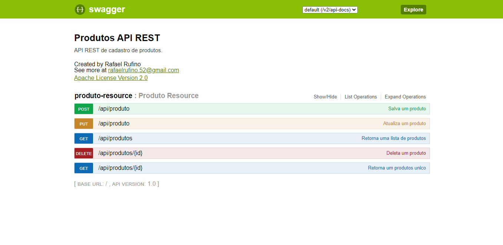
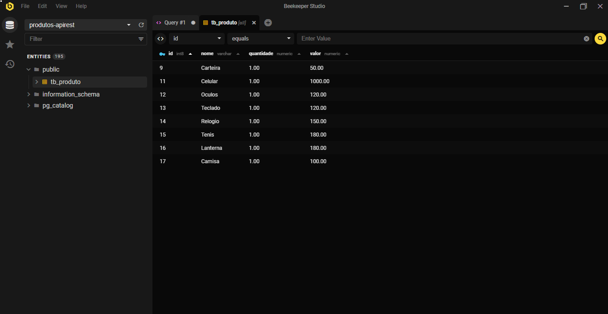

<h3 align="center">
    
    <br><br>
    <b>Produtos API REST</b>
    <br>
    <br>
</h3>


<p align="center">
  <a href="#sobre">Projeto</a>&nbsp;&nbsp;&nbsp;|&nbsp;&nbsp;&nbsp;
  <a href="#tecnologias-utilizadas">Tecnologias</a>&nbsp;&nbsp;&nbsp;|&nbsp;&nbsp;&nbsp;
  <a href="#como-usar">Como Usar</a>&nbsp;&nbsp;&nbsp;|&nbsp;&nbsp;&nbsp;
  <a href="#Como-Contribuir">Como Contribuir</a>
</p>

<p align="center">
 

  
</p>

<br>


<a id="sobre"></a>


## :bookmark: Sobre

A <strong>API REST Produtos </strong> é uma aplicação criada com spring-boot, utilizando o banco de dados postgres para pesistir os dados.


<a id="tecnologias-utilizadas"></a>

## :rocket: Tecnologias Utilizadas

O projeto foi desenvolvido utilizando as seguintes tecnologias

- [Spring-Boot]
- [Postgres]
- [Swagger]


<br>

## :heavy_check_mark: :computer: Resultado Web

<h1 align="center">
    

</h1>
<h1 align="center">
    

</h1>


<a id="como-usar"></a>

## :fire: Como usar

- ### **Pré-requisitos**

  - É **necessário** possuir o **[JDK] java e **[Maven]()** instalado na máquina
  - Também, é **preciso** ter banco de dados **[postgres]
  


1. Faça um clone :

```sh
  git clone https://github.com/Rafael-Rufino/api-rest-produtos.git
```

2. Executando a Aplicação:

```sh

  # Inicie a aplicação web
  o$ cd api-rest-produtos
  $ mvn spring-boot:run 


  
  # Acessar o Servidor no Navegador
  $ http://127.0.0.1:8080/
 
  # Acessar Swagger
  $ http://localhost:8080/swagger-ui.html#/


```
  
<a id="Como-Contribuir"></a>


## :recycle: Como contribuir

- Faça um Fork desse repositório,
- Crie uma branch com a sua feature: `git checkout -b my-feature`
- Commit suas mudanças: `git commit -m 'feat: My new feature'`
- Push a sua branch: `git push origin my-feature`


🎓 **Quem ministrou?**

As aulas foram ministradas pela mestre Michelli Brito 

📝 **License**

Esse projeto está sob a licença MIT. Veja o arquivo [LICENSE](LICENSE.md) para mais detalhes.


<h4 align="center">
    Feito com 💜 by <a href="https://www.linkedin.com/in/rafael-r-dos-santos-b889311ba/" target="_blank">Rafael Rufino</a>
</h4>


